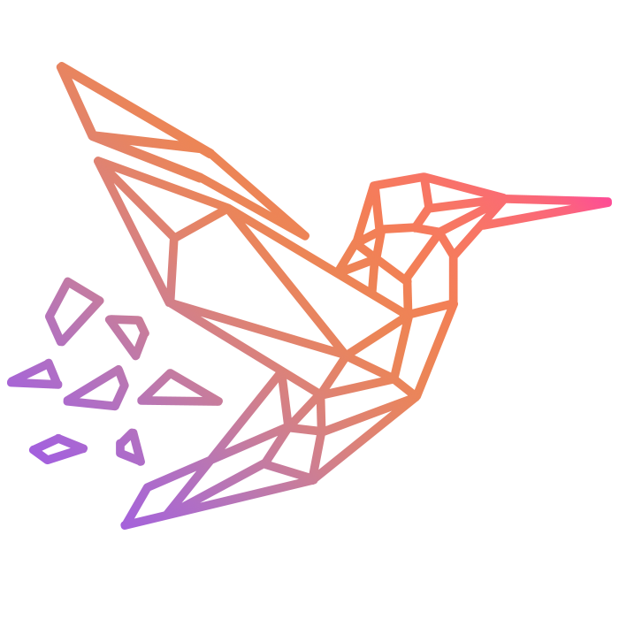
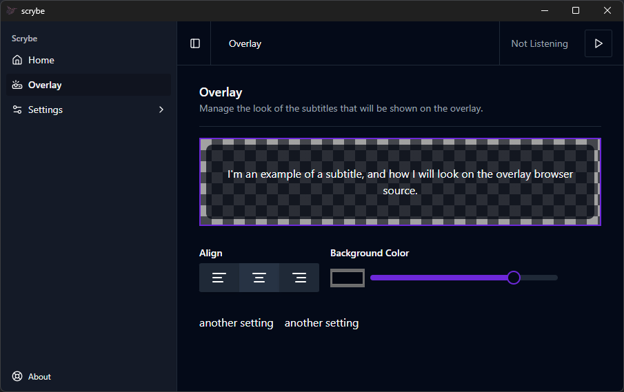

  

# Local Subtitles for your own Broadcasts

Currently most subtitling programs available to add closed captioning to your own broadcasts cost money and/or require a remote service. This is a basic attempt at a fully local, livestream-native subtitling program.

  

## Plans

This is still in very early development so it's not really usable as-is. If you're really interested before I finish updating this, you can message me on discord and I can help you set it up.
